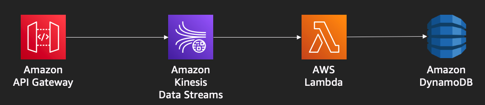

# serverless-streaming-demo

A very simple serverless data streaming processing that I use to talk to customers and students.

This is the architecture that we are going to use as an starting point for this demo:

To deploy this environment on you AWS account, follow these steps:

1. Create a Cloud9 instance
2. Clone this repository: https://github.com/fabianmartins/serverless-streaming-demo
3. cd serverless-streaming-demo/
4. npm install 
5. npm audit fix
6. npm run build
7. cdk synth > output.yaml
8. Explore the file output.yaml. It contains the Cloudformation template generated by CDK.
8. (if this is the first time using cdk in this account/region)
   - cdk bootstrap
9. cdk deploy
10. Explore the deployed environment.
      - If you don't know where to start, go to CloudFormation and explore the resources created under the **TradingStack** Cloudformation stack.

Now you can do some of the labs that I am sharing here.

- [The DLQ lab](labs/dlq/README.md) is about implementing a DLQ for the Kinesis-Lambda integration.
- [The EventBridge lab](labs/evenbridge/README.md) is about implementing an EventBridge integration so other systems can respond to events generated by this architecture.
- [The Observability lab](labs/observability/README.md) is about exploring the basics of the AWS native observability capabilities.

***

### Closing the lab

Any time you want to get rid of the environment, follow the steps below:

- Run `cdk destroy`. If some elements are not deleted (because they were changed by hand), delete them via console.
    - Particularly, if you have changed/updated the Lambda-Kinesis integration by hand, it can remain orphan in your account. To check that, do this:
        - Run `aws lambda list-event-source-mappings` to get the list of source mappings.
        - If you find any involving TradingStream and StoreOrders, get its uuid.
        - Run `aws lambda delete-event-source-mapping --uuid <the uuid you got>` to delete it.