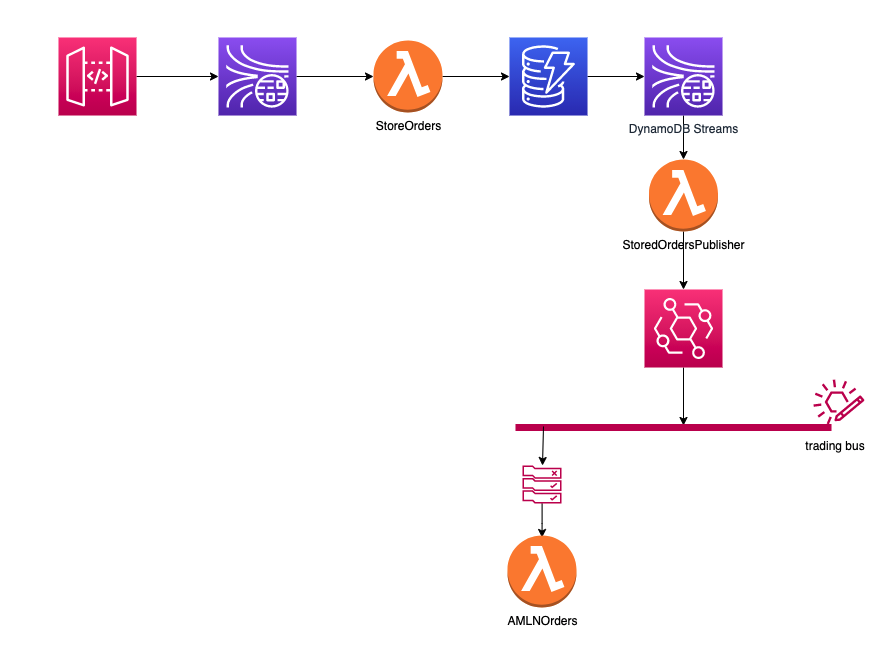

# EventBridge

This lab considers that:
- You are working from a Cloud9 environment.
- That you have cloned this repository and have already deployed the environment.
- That you already have run the [DLQ](./../dlq/README.md) and [Observability](./../observability/README.md) labs

***

## Scenario

Consider the following requirement for [our architecture](pics/architecture.png): 

*"Due the section 55 of the normative AMLMN, any transaction that goes beyond a certain value (quantity X price) must be reported accordingly into the different reports, as indicated by the regulation. Currently, over $50K USD, but this can change, and we have systems in different accounts and regions which need to be notified of every order of this type.*

* Note: *AMLMN* means *"Anti-Money Laundering Monitoring Normative"*, and it is, well, a fake normative invented for the purpose of this lab.

***

## The architecture that we are proposing  

In this architecture we are going capture the records inserted into DynamoDB using DynamoDB Streams, and have them sent to the StoredOrdersPublisher function. This function then is going to modify the orders to compute their total value and add it as a property into the payload, and then publish it into the trading custom event bus on EventBridge. A rule that is configured to filter events whose total value is equal or greater than $50,000 and will send them to the AMLNOrders.

Here you should ask some questions:

1. Why not change the StoreOrders function and having it writing directly to EventBridge instead of using a DynamoDB stream and another Lambda function (StoredOrdersPublisher)?
2.  [*"Why not to use SNS with a cross-account/multi-region deployment to send those notifications?"*](https://aws.amazon.com/blogs/compute/cross-account-integration-with-amazon-sns/)

These are questions to be discussed in group.

***

## Implementation

1. Go to EventBridge and create a Custom event bus with the name *`trading`*.

2. Visit the DynamoDB console and enable DynamoDB streams for the `TradingOrders` table

3. Create the  Lambda function `StoredOrdersPublisher` that will act as a trigger that is going to post data into EventBridge.
    - Use the documentation as a reference: https://docs.aws.amazon.com/amazondynamodb/latest/developerguide/Streams.Lambda.Tutorial.html
    - Open the following link and use it as the code for your lambda function: [index.js](./lambda/StoredOrdersPublisher/index.js)
    - Don't forget to give the permissions for your Lambda Function to put events on the EventBridge bus.

4. Get the ARN for the DynamoDB stream.
   - If you are on Cloud9, run the following command:
        ~~~
        aws dynamodb describe-table --table-name TradingOrders --query "Table.LatestStreamArn" --output text
        ~~~
    - You can also find the ARN by visiting your DynamoDB table on the console.

5. Create the event source mapping that integrates the DynamoDB streams with the Lambda Function `StoredOrdersPublisher`.
    - On your Cloud9 terminal, run the command below, replacing `<region>` and `<dynamodb streams arn>` with the appropriate values
        ~~~
        aws lambda create-event-source-mapping \
            --region <region> \
            --function-name StoredOrdersPublisher \
            --event-source <dynamodb streams arn>  \
            --batch-size 20 \
            --starting-position TRIM_HORIZON
        ~~~

6. Create a new Lambda function, name it AMLMNOrders and input the following code inside it. At this moment we are only going to track what has been received as an event coming from EventBridge:

~~~
exports.handler = async (event) => {
    // log the event
    console.log(JSON.stringify(event));
    const response = {
        statusCode: 200
    };
    return response;
};
~~~

7. Create a rule that will filter events in the scope of the AMLMN regulation from EventBridge.
    1. Go on `Rules`.
    2. Select the event bus `trading`.
    3. Click on `Create Rule`.
        1. For `Name` input `AMLMNOrders-section55`.
        2. For `Description` input `Anti-Money Laundering Regulation - Section 55`.
        3. For the section `Define Pattern``
            1. Select `Custom pattern`.
            2. Input the following pattern:
                ~~~
                {
                    "source": ["tradingsystem"],
                    "detail-type": ["order"],
                    "detail": {
                        "Total": [{"numeric": [">=", 50000]}]
                    }
                }
                ~~~
        4. For the section `Select Target`, select `Lambda function`, and then select the `AMLMNOrders` function.
        5. Expand the section `Configure input`
            1. Select `Part of the matched event`.
            2. Input `$.detail`.
        6. Save the rule.

8. Test the rule by sending valid orders that have value below and over $50K.

***

## Additional comments

### What is still missing here? 
- What happens if we have a problem with the AMLMNOrders function?
- Can you instrument it with X-Ray?

### What if I need to test the function by sending an event straight to EventBridge?

Adjust the following payload and use it

~~~
{
    "id" : "6a7e8feb-b491-4cf7-a9f1-bf3703467718",
    "account" : "123456789012",
    "region" : "us-east-2",
    "time" : "2017-12-22T18:43:48Z",
    "resources" : ["arn:aws:lambda:us-east-2:123456789012:function:AMLMNOrders"],
    "source": "tradingsystem",
    "detail-type": "order",
    "detail": {
        "Order": {
          "Volume": 18453,
          "Price": 104.987,
          "Symbol": "USDJPY"
        },
        "User": "theuser@amazon.com",
        "Client": "13522bac-89fb-4f14-ac37-92642eec2b06",
        "Timestamp": "2021-03-02T13:03:17Z",
        "TransactionId": "theuser@amazon.com#13522bac-89fb-4f14-ac37-92642eec2b06#USDJPY#18453#104.987#2021-03-02T13:03:17Z",
        "Total": 50001
    }
}
~~~